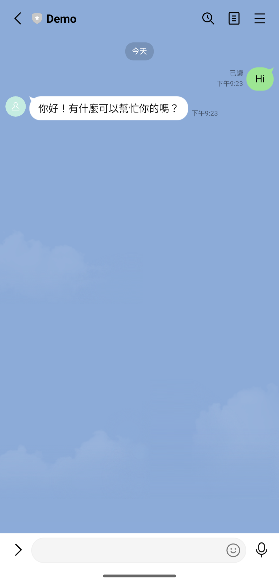

# openai-line-bot

## Prerequesites

- Google Cloud Platform Account
- LINE Channel (Access Token & Secret)
- OpenAI API Key

## How to Run

1. Create a Cloud Function with public access and add the following runtime environment variables:
   ```
   CHANNEL_ACCESS_TOKEN=
   CHANNEL_SECRET=
   OPENAI_API_KEY=
   ```
2. Copy the contents of `main.py` and `requirements.txt` to the cloud function and set its entrypoint to `linebot`
3. Deploy the cloud function
4. Set the LINE Channel Webhook URL to the cloud function URL
5. Verify the service is up and running

## Screenshots



## Credits

- https://medium.com/@chiehwen0926/line-聊天機器人-輕鬆模仿與互動的終極指南-gcp-cloud-functions-應用實例-d4f43db3ca67
